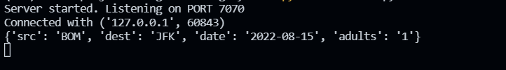

<h1 align="center"> Flight Booking System </h1>

## Table of Contents
- [**Visuals**](#visuals)
- [**Usage**](#usage)
- [**Testing Travel API**](#testing-travel-api)
- [**Miscellanous**](#miscellanous)
***

## Visuals

---

---

---


## Usage

## Step 1 - Create a local repository
- Clone the repository.

```bash
git clone git@github.com:nkilm/flight-booking-system.git
```
- Create a **Virutal Environment** in the project folder.
- Install all the Dependencies/Packages.
```bash
pip install -r ./requirements.txt
```

## Step 2 - Travel API
- Create an account in [Amadeus](https://developers.amadeus.com/)
- Login to your Amadeus developer account and go to `My Self-Service Workspace`. 
- Create a project with appropriate name.
- `API Key` and `API Secret` will be given after a project is created.

## Step 3 
- Create a `.env` file in the project folder 
- Add the following to `.env` file 

```env
# This is inside .env file

`API_KEY` = API Key
`API_SECRET` = API Secret 
```
## Step 4 
- Run `server.py` file
- Run `client.py` file 
  
`Note : Server should be running first to avoid getting connection error`
***
[Back to Top ⬆](#table-of-contents)
## Testing Travel API
`Amadeus Travel API used in this project`
- I have used [Thunder Client](https://marketplace.visualstudio.com/items?itemName=rangav.vscode-thunder-client) for API testing. You can use any API testing clients.
- To test the API, import the collection (.json file) from `./testing-api` and add it to your collection.

[*How to Import collection in Postman/Thunder Client?*](https://github.com/rangav/thunder-client-support#:~:text=How%20to%20Import%20Collection)
- Fill in `Client ID` and `Client Secret` with `API Key` and `API Secret` respectively.
- Generate token if token expires.

[Back to Top ⬆](#table-of-contents)